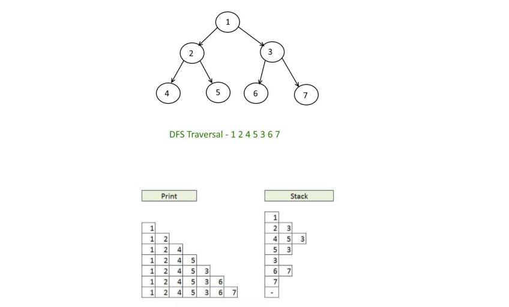

**PreOrderTraversal** : 8 3 1 6 4 7 10 14 13            Root LC RC

**InOrderTraversal** : 1 3 4 6 7 8 10 13 14             LC Root RC

**PostOrderTraversal** : 1 4 7 6 3 13 14 10 8           LC RC Root

**LevelOrderTraversal OR BFS(Breadth First Search)** : 8 3 10 1 6 14 4 7 13

**LevelReverseOrderTraversal** : 8 10 3 14 6 1 13 7 4

**DepthFirstSearch or Vertical Order Traversal** :  8 3 1 6 4 7 10 14 13




**LeftView** : 8 3 1 4
**RightView** : 8 10 14 13

**Leaf Sum** : 25

**IsBst** : true

**Height** : 4

**Maximum Sum Leaf to Root path** : 45

**Path** : 13 14 10 8

**SortedArrayToBst**
8 3 1 6 4 7 10 14 13

---Balanced Tree : A tree where no leaf is much farther away from the root than any other leaf.
**IsBalancedTree** : false

Find path which has sum equal to give value
 8 3
 
Print all paths from root to leaf
8 3 1
8 3 6 4
8 3 6 7
8 10 14 13


````
Convert to Binary Tree from PreOrder and InOrder Traversal

PreOrderTraversal : 8 3 1 6 4 7 10 14 13            Root LC RC
InOrderTraversal : 1 3 4 6 7 8 10 13 14  

pIndex = 0;

makeBTree(InOrder[], preOrder[], 0, InOrder.length()-1)

Node -> Node.data = preOrder[pIndex];
pIndex++;

int index = getInOrderIndex() -> 5

root.left = makeBTree (InOrder[], preOrder[], 0, 4)

root.right = makeBTree (InOrder[], preOrder[], 5, inOrder.length()-1)


Take the element from the preOrder and now all the elements in the InOrder which are left to it
Will be on the left side of the binary tree from it
````

