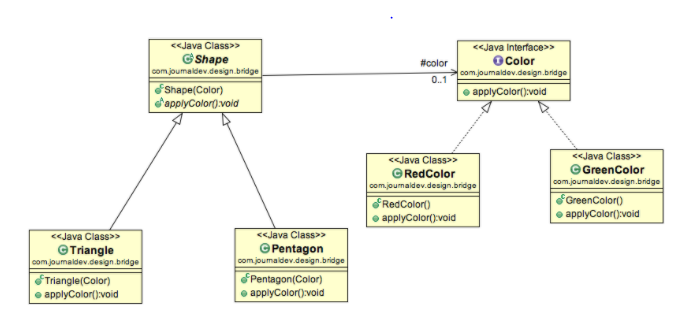
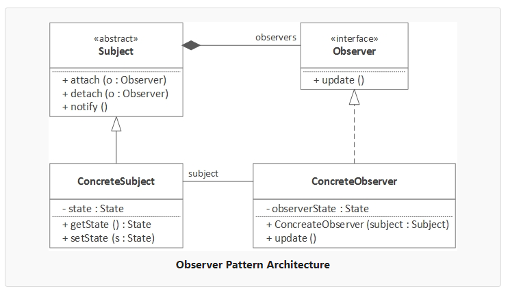
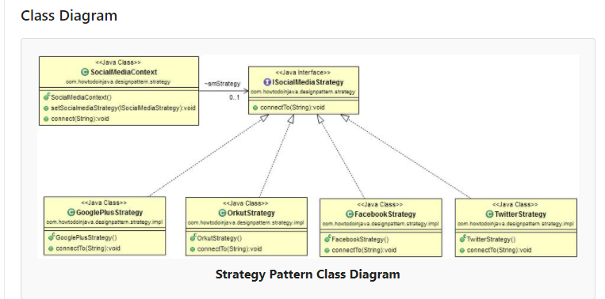
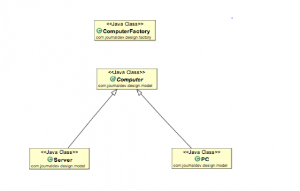
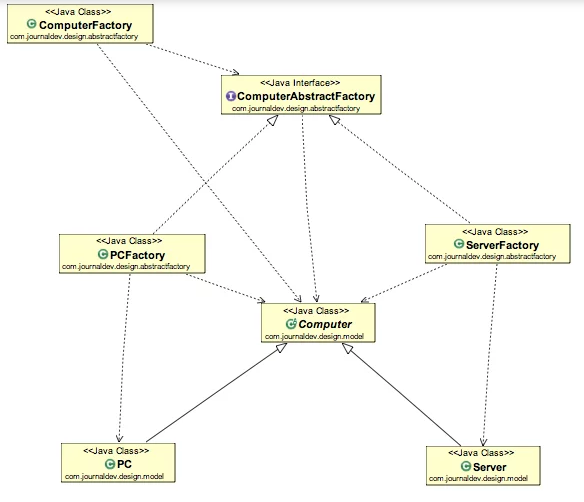

**Bridge Design Pattern** : Decouple an abstraction from its implementation so that the two can vary independently
                        The bridge design pattern allows the Abstraction and the implementation to be developed independently and the client code can access only the Abstraction part without being concerned about the implementation part. 
                        Bridge design pattern can be used when both abstraction and implementation can have different hierarchies independently and we want to hide the implementation from the client application.
                        
                        


**Facade Design Pattern** : Provide a unified interface to a set of interfaces in a subsystem. Facade Pattern defines a higher-level interface that makes the subsystem easier to use
                            Facade design pattern can be applied at any point of development, usually when the number of interfaces grow and system gets complex.
````
public static void generateReport(DBTypes dbType, ReportTypes reportType, String tableName){
Based on dbType
Select Db
MySql or Oracle
Based on reportType
Select Report
````

**ObserverDesignPattern**
According to GoF definition, observer pattern defines a one-to-many dependency between objects so that when one object changes state, all its dependents are notified and updated automatically. It is also referred to as the publish-subscribe pattern.



**Strategy design pattern**
Strategy design pattern is behavioral design pattern where we choose a specific implementation of algorithm or task in run time – out of multiple other implementations for same task.



**Singleton**

The Singleton design pattern ensures that only one object of a particular class is created. All the further references to the Objects of the singleton class refer to the same instance.

private static volatile Singleton soleInstance = null;

How to break singleton design pattern
1) Reflection
2) Serialization/Deserialization
3) Clone
4) MultiThreaded Access
5) Multiple Class Loaders
6) Garbage Collection


**Factory Design Pattern**

The factory design pattern is used when we have a superclass with multiple sub-classes and based on input, we need to return one of the sub-class. This pattern takes out the responsibility of the instantiation of a class from the client program to the factory class.



````
public class ComputerFactory {

	public static Computer getComputer(String type, String ram, String hdd, String cpu){
		if("PC".equalsIgnoreCase(type)) return new PC(ram, hdd, cpu);
		else if("Server".equalsIgnoreCase(type)) return new Server(ram, hdd, cpu);
		
		return null;
	}
}
````

**Abstract Factory Design Pattern**

If you are familiar with factory design pattern in java, you will notice that we have a single Factory class. This factory class returns different subclasses based on the input provided and factory class uses if-else or switch statement to achieve this.

In the Abstract Factory pattern, we get rid of if-else block and have a factory class for each sub-class. Then an Abstract Factory class that will return the sub-class based on the input factory class. At first, it seems confusing but once you see the implementation, it’s really easy to grasp and understand the minor difference between Factory and Abstract Factory pattern.

Like our factory pattern post, we will use the same superclass and sub-classes



**Builder Design Pattern**

Builder pattern was introduced to solve some of the problems with Factory and Abstract Factory design patterns when the Object contains a lot of attributes.

1) Send in order of Attributes
2) Send null for unwanted Attributes
3) Complex

Builder pattern solves the issue with large number of optional parameters and inconsistent state by providing a way to build the object step-by-step and provide a method that will actually return the final Object.


