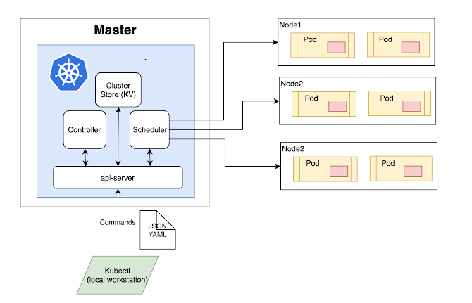

**Master Node**: The master node is the first and most vital component which is responsible for the management of Kubernetes cluster. It is the entry point for all kinds of administrative tasks. There may be more than one master node in the cluster to check for fault tolerance.

**API Server**: The API server acts as an entry point for all the REST commands used for controlling the cluster.

**Scheduler**: The scheduler schedules the tasks to the slave node. It stores the resource usage information for every slave node. It is responsible for distributing the workload.

**Etcd**: etcd components, store configuration detail, and wright values. It communicates with the most component to receive commands and work. It also manages network rules and port forwarding activity.

**Worker/Slave nodes**: Worker nodes are another essential component that contains all the required services to manage the networking between the containers, communicate with the master node, which allows you to assign resources to the scheduled containers.

**Kubelet**: It gets the configuration of a Pod from the API server and ensures that the described containers are up and running.

**Docker Container**: Docker container runs on each of the worker nodes, which runs the configured pods.

**Pods**: A pod is a combination of single or multiple containers that logically run together on nodes.

**The node port service** is a fundamental way to get external traffic to your service. It opens a particular port on all nodes and forwards network traffic sent to this port.

**The kubelet** is a service agent which controls and maintains group pf pods by checking pod specification using Kubernetes.

Secrets are sensitive information like login credentials of the user. 

