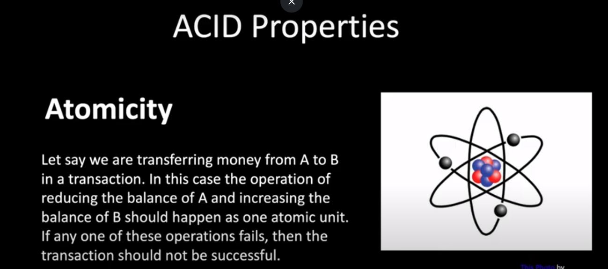
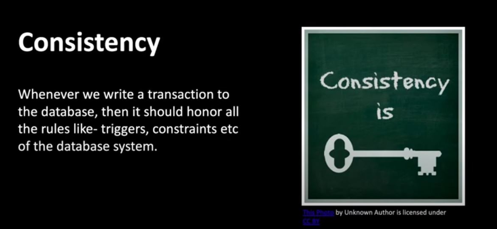
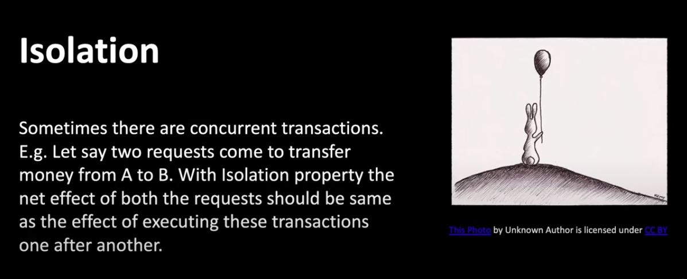
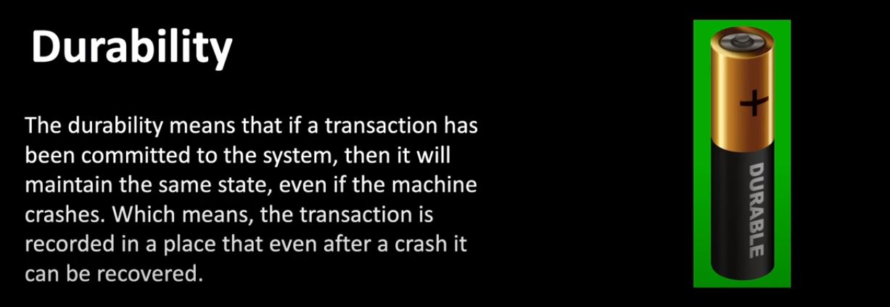

ACID

Atomicity
Consistency
Isolation
Durability

Atomicity : Either commit all or nothing.

Consistency : Make consistent record in terms of validate all rule and constraint of transaction.

Isolation : Make sure that two transaction is unaware to each other.

Durability : committed data stored forever

