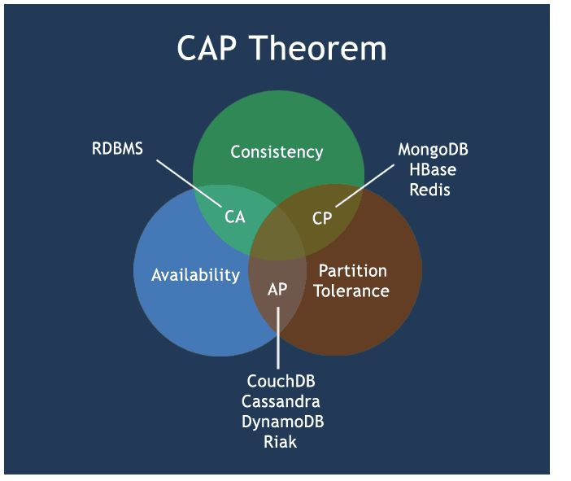

CAP

https://medium.com/@bikas.katwal10/mongodb-vs-cassandra-vs-rdbms-where-do-they-stand-in-the-cap-theorem-1bae779a7a15

As per him it is impossible to provide all the three properties

**Consistency** : It means that u are read is getting most recent write

**Availability** : Availability means every request should get a non error response

**PartitionTolerance** : System should continue to work even if its few nodes are down

PartitionTolerance needs to be there
Hence choice should be between AP and CP

Amazon : AP

Bank : CP

RDBMS : CA

It’s no brainer that all RDBMS are Consistent as all reads and writes go to a single node/server.

In a single node system, there will not be any network partition hence if the node is up, it will always return success for any read/write operation and hence available.
 
MONGO : CP

Single parent 2 slave

CASSANDRA : AP
 