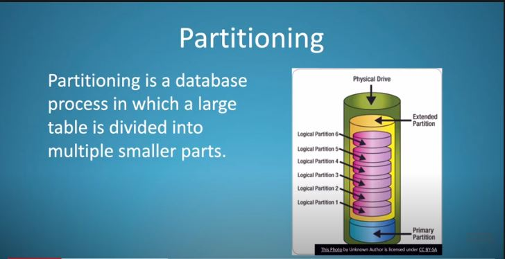
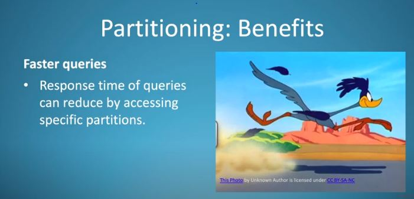
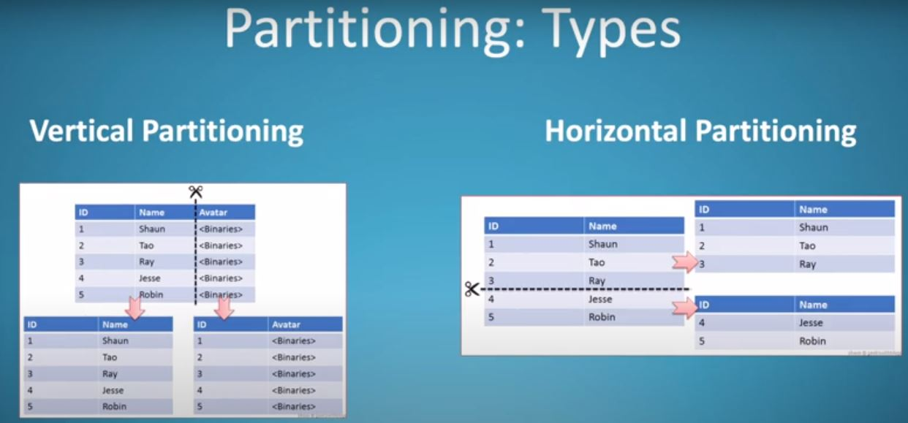
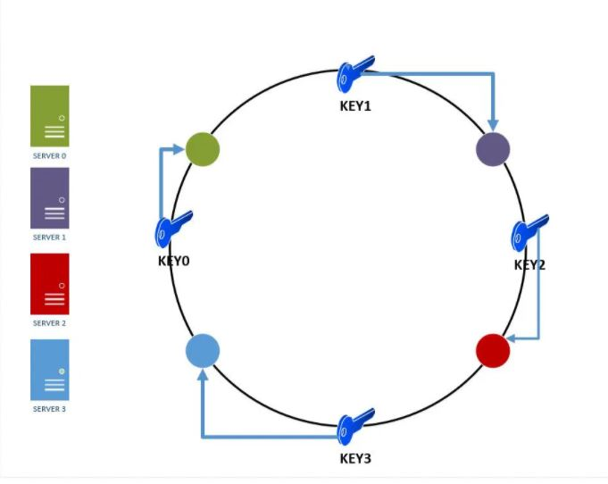

https://www.acodersjourney.com/database-sharding/

Sharding (also known as Data Partitioning) is the process of splitting a large dataset into many small partitions which are placed on different machines. Each partition is known as a "shard".
Each shard has the same database schema as the original database. Most data is distributed such that each row appears in exactly one shard. The combined data from all shards is the same as the data from the original database.

As more users are onboarded on your system, you'll experience performance degradation with a single database server architecture . Your read queries and updates will start become slower and your network bandwidth may be start to saturate . You'll probably start running out of disk space on your database server at some point.

Sharding helps to fix all the above issues by distributing data across a cluster of machines. In theory, you can have a huge number of shards thereby providing virtually unlimited horizontal scaling for your database.
    
**DATABASE SHARDING OR PARTITIONING TYPES**

1) Horizontal Partitioning
2) Vertical Partitioning
3) Key or HashBased Partitioning
4) Directory based sharding

**DATABASE SHARDING OR PARTITIONING TYPES**

1) Horizontal Partitioning
    -> Range Based Partitioning -> Partitioning on basis of range
    -> Disadvantage -> Chances that data is appearing mostly on one particular range
2) Vertical Partitioning
    -> different features of an entity will be placed in different shards on different machines.
    -> Disadvantage -> Complexity -> With inc u need to further divide entity
3) Key or HashBased Partitioning
    -> Say this in interview as preferable
    
4) Directory based sharding

**HashBased Partitioning**

So basically I will write one hash function.
So suppose I have four database servers and I wrote one hash function modulus by 4.
And will store on basis of this hash function in one of the db servers.

The main drawback of this method is that elastic load balancing ( dynamically adding/removing database servers) becomes very difficult and expensive. 

For example, if we wanted to add 6 more servers, majority of the keys would need to be remapped and migrated to new servers. Also, the hash function will need to be changed from modulo 4 to modulo 10.

To solve this problem we use **consistent Hashing**

https://www.acodersjourney.com/system-design-interview-consistent-hashing/

