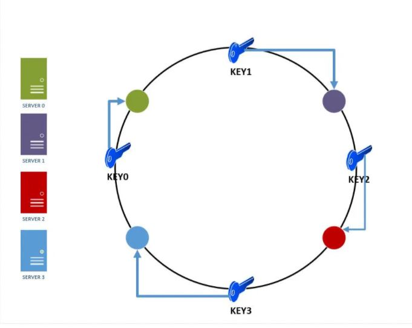

**ACID**

````
Atomicity Consistency Isolation Durability

Atomicity : Either commit all or nothing.
Consistency : Make consistent record in terms of validate all rule and constraint of transaction.
Isolation : Make sure that two transaction is unaware to each other.
Durability : committed data stored forever e.g. powerCut
````

**BASE**

````
BA -> Basically Available
S -> Soft State
E -> Eventual Consistency
````

**CAP**

````
As per him it is impossible to provide all the three properties

Consistency : It means that your read is getting most recent write
Availability : Availability means every request should get a non error response
PartitionTolerance : System should continue to work even if its few nodes are down

````

**CDN(Content Delivery Network)**

````
To minimize the distance between the visitors and your website’s server, a CDN 
stores a cached version of its content in multiple geographical locations
(a.k.a., points of presence, or PoPs). Each PoP contains a number of caching servers
responsible for content delivery to visitors within its proximity.
````


**LoadBalancer**

````
Types
1) Client
2) Server
````

**Types of NoSql**

1) Key value Store : Redis, Riak
2) Wide Column Store : Cassandra, HBase
3) Document Databases : MongoDb
4) Graph Databases : Neo4j, HyperGraphDB


**Partitioning**

Partitioning is a database process in which a large table is divided into multiple
smaller parts.

Advantage : Faster Queries : Response time of queries can reduce by accessing specific
partitions

**Sharding**

Sharding (also known as Data Partitioning) is the process of splitting a large dataset 
into many small partitions which are placed on different machines. Each partition is 
known as a "shard". Each shard has the same database schema as the original database. 
Most data is distributed such that each row appears in exactly one shard. 
The combined data from all shards is the same as the data from the original database.

**DATABASE SHARDING OR PARTITIONING TYPES**

1) Horizontal Partitioning
2) Vertical Partitioning
3) Key or HashBased Partitioning
4) Directory based sharding





**MONGO**

Mongos communicates with config server to know data is stored in which replica cluster.

mongod is the primary daemon process for the MongoDB system. It handles data requests,
manages data access, and performs background management operations.


**SCALING**

Scaling means the ability to handle increase or decrease in growth, demand or work by a 
system.

Vertical scaling is the adding of extra power, memory etc to an existing machine. 

Horizontal scaling means adding extra machines to a system to handle the increase in load.
Horizontal scaling is also known as scale-out. In horizontal scaling, we add more machines and
set it up as a cluster of machines to handle the increase or decrease in requirements. 