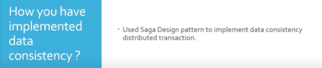
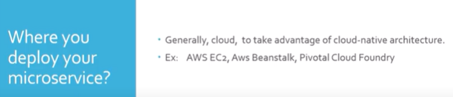

Microservices : An architectural approach to develop applications, where application consists of multiple independent components.
These components are basically services communicating through lightweight mechanism.

Difference between monolithic and microservices?

Monolithic:
1) Centralized architecture
2) Easier to test application and debug
3) Cross-cutting concerns such as monitoring, logging is at one application only
4) Scaling is issue

Microservices
1) Distributed Architecture
2) Independent Services
3) Scaling and deployment is easy
4) Cross-cutting concerns are implemented at each service
5) No technology barrier

Advantages :
 
1) Every service are independent, standalone and represent a particular business functionality
2) Scaling is easy and feasible
3) Deployment is easy and feasible
4) No technology barrier

Disadvantage :

1) Implementation of distributed transaction
2) Implement logging and visualization of logs for a particular request
3) Increase complexity in number of microservices increasing
4) Additional infrastructure cost. Even if you are on cloud you have to pay for cloud use.

Suppose there are three microservices A,B and C how do they communicate with each other

Using RestTemplate or WebClient(Reactive RestTemplate)
Using Service Discovery Pattern(Lets say 300-500). Eurerka 

Have you implemented Service Discovery?
Yes
With Netflix Eureka as well as Zookeeper
Done both client side service discovery as well as server side service discovery

Suppose there are three microservices A, B and C what will happen if C fails

You can implement circuit breaker pattern at C, in order to do compensating actions
You can use Hystrix as circuit breaker
To do so you have to enable circuit breaker in main spring boot class and write fallback method for failing method in C.

