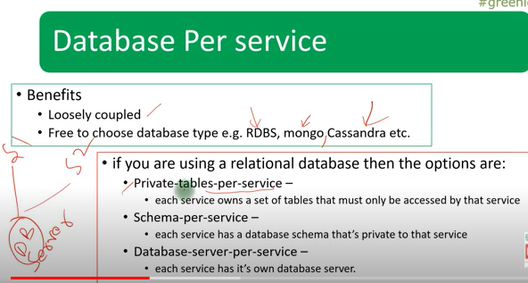
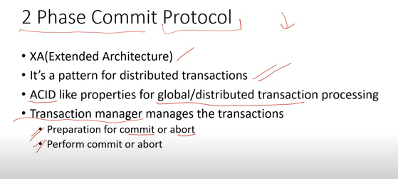

###### STRANGLER DESIGN PATTERN

###### SIDECAR/SIDEKICK DESIGN PATTERN

###### SERVICE MESH DESIGN PATTERN

###### DATABASE PER SERVICE

###### CQRS (Command Query Responsibility Segregation)

###### STRONG VS EVENTUAL CONSISTENCY

###### EVENT SOURCING SYSTEM

###### TWO PHASE COMMIT

###### SAGA

###### GRAPHQL

###### AGGREGATOR PATTERN
You can use Api Gateway also to aggregate

###### CLIENT SIDE UI COMPOSITION PATTERN

###### SERVERLESS

###### ROLLING DEPLOYMENT PATTERN

###### CANARY DEPLOYMENT PATTERN

###### BLUE GREEN DEPLOYMENT PATTERN
With microservice architecture, one application can have many microservices. If we stop all the services then deploy an enhanced version, the downtime will be huge and can impact the business. Also, the rollback will be a nightmare. Blue-Green Deployment Pattern avoid this.
The blue-green deployment strategy can be implemented to reduce or remove downtime. It achieves this by running two identical production environments, Blue and Green. Let’s assume Green is the existing live instance and Blue is the new version of the application. At any time, only one of the environments is live, with the live environment serving all production traffic. All cloud platforms provide options for implementing a blue-green deployment.

