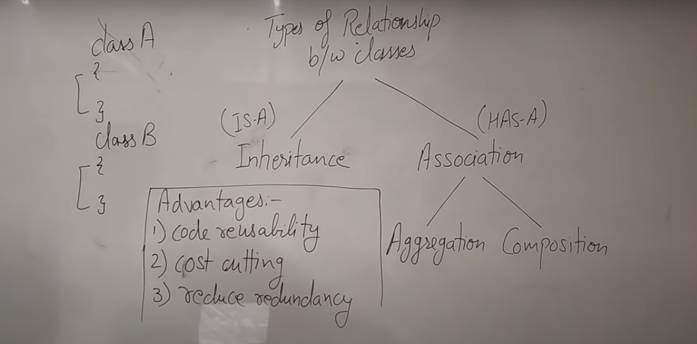
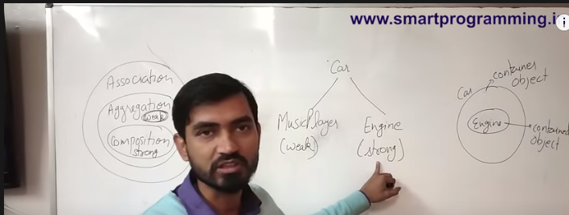
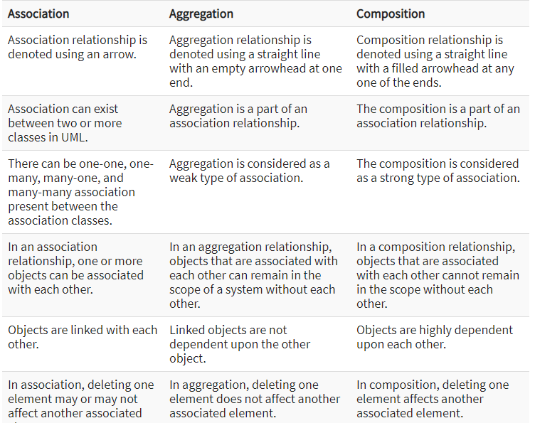

Inheritance
http://www.javapedia.net/Inheritance

1. What are the differences between composition and inheritance in Java?
    
    
    

2. Are static members inherited to sub classes?

`Super class static member will be hidden at the sub class.
`
3. What happens if the parent and the child class have a field with same identifier?
4. Are constructors and initializers also inherited to sub classes?
`No, Constructors and initializers (Static initializers and instance initializers) are not inherited to sub classes. But, they are executed while instantiating a sub class.
`5. How do you restrict a member of a class from inheriting by its sub classes? -> private
6. How do you implement multiple inheritance in java? -> interface
7. How Inheritance is implemented in java? -> 
8. Types of inheritance.
9. Can a class extend by itself in Java?
10. Can we reduce the visibility of the inherited or overridden method?
11. How do you override a private method in java?
12. Whe