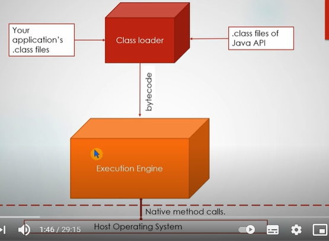
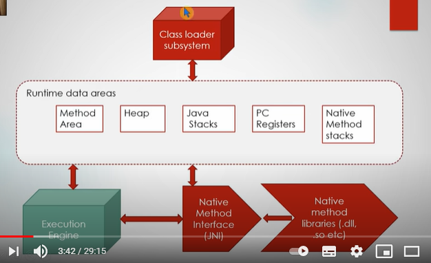
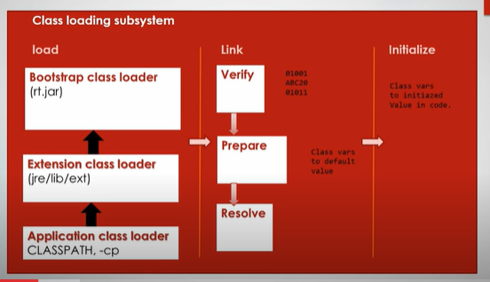
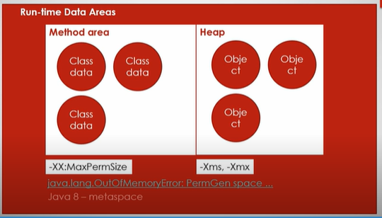
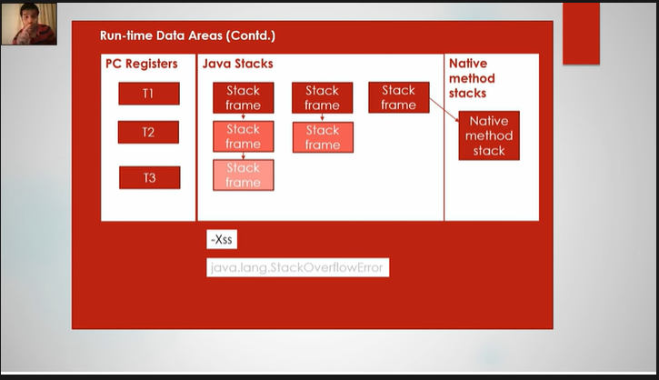
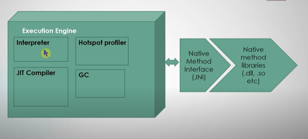

1) Our class files(Hello.class) is loaded along 
with .class files of java api
   
2) Execution Engine takes the byte code and communicates
through the operating system via native method calls.

Load : Will load the .class files
        Bootstrap Extension Application
Link : Verify : Verifies if bytecode is compatible
       Prepare : Memory is allocated for static variables. It will be initialized with default value
       Resolve : References are resolved
Initialize :
        Static blocks are executed
        Static variables are initialized with actual value

ClassNotFoundException happens when classLoader fails to find the .class of that particular class
ClassDefNotFound happens at time of Resolve

Method Area : Metadata corresponding to class is stored
              Static vars are stored here
              Method area is PermGen Space
              By default 64 MB is allocated to permGen, but it can be tuned
              
              -XX:MaxPermSize
              -XX:PermSize
              **OutOfMemoryError**

Java 8 : PermGen is replaced by MetaSpace
        Moved the method area into a separate memory in native operating system
        So by default there is no limit to memory

Heap : Object Data is stored

        -Xms
        -Xmx

PcRegister : Program Counter Register
            Pointer to the next instruction to be executed per thread.
           
Java Stacks : Consists of stack frame per thread

        -Xss 
        Stackoverflowerror

Native Method Stack : If i am calling some dll or native methods

ExecutionEngine :
        Interpreter : Takes bytecode and executes it using native method interface 
        JIT Compiler : Repeated steps will be compiled and target code would be kept for execution
        GC
        HotSpotProfiler
                    