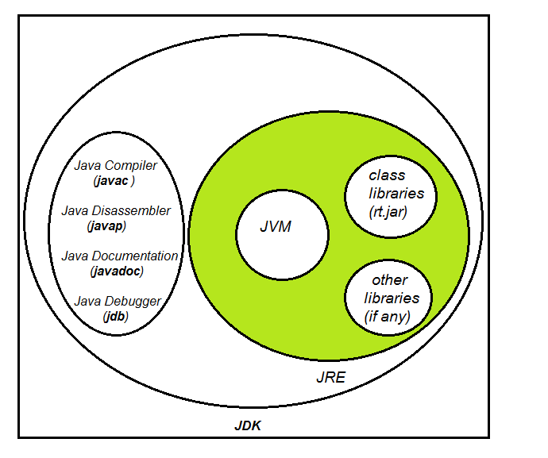

Q35. What is exception propagation in java?

Whenever methods are called stack is formed and an exception is first thrown from the top of the stack and if it is not caught, it starts coming down the stack to previous methods until it is not caught. 
If exception remains uncaught even after reaching bottom of the stack it is propagated to JVM and program is terminated. 

