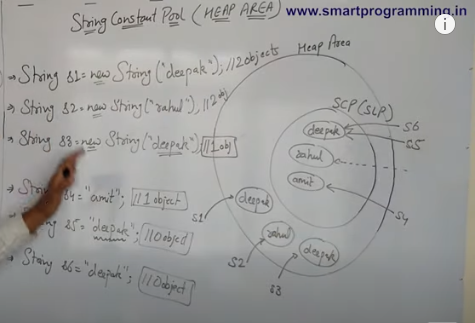
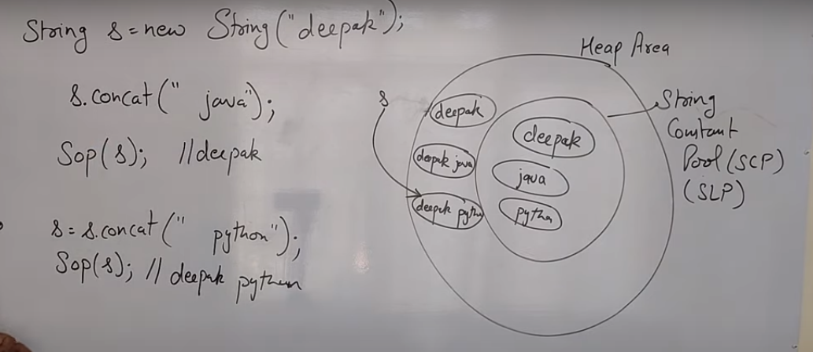

From 1.7 string constant pool is in heap area
Till 1.6 it was under method area

String objects are immutable. It means once string objects are created its data or state cannot be changed but a new string object is created

