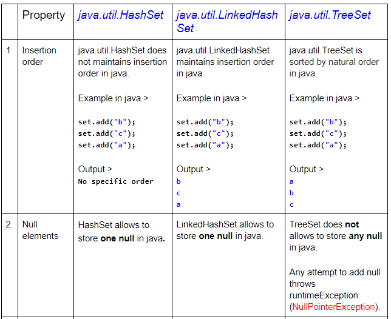
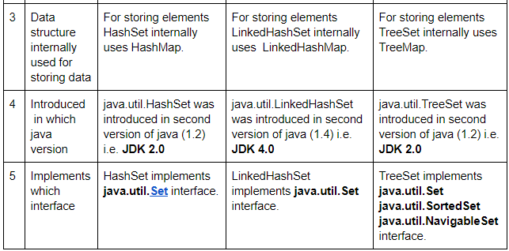
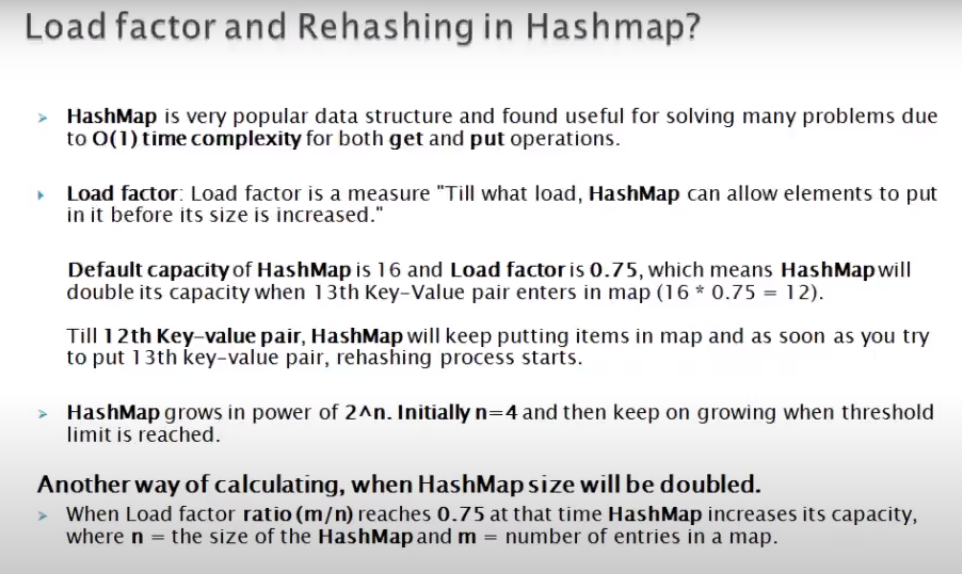
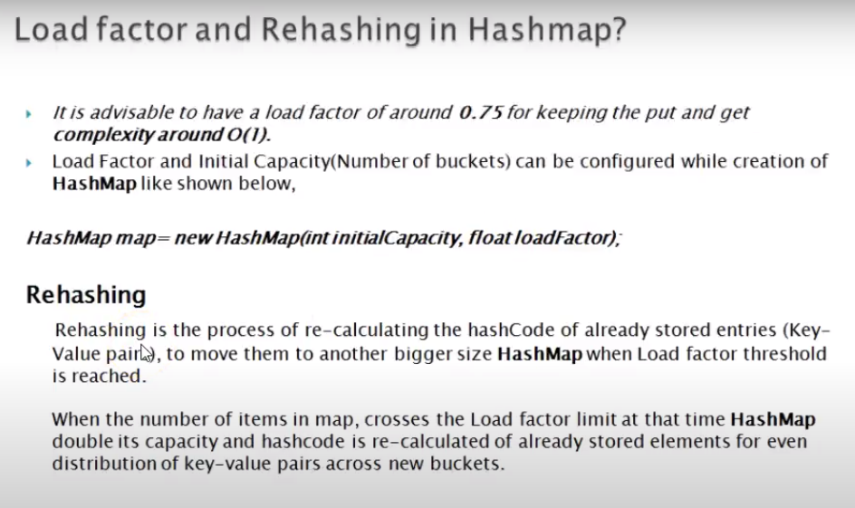
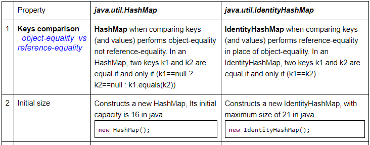

```
HashMap is not synchronized, it allows one null key and many null value

Concurrent hashMap is synchronized thread safe, it doesn't allow null key and value.

Map synchronizedMap = Collections.synchronizedMap(hashMap);

ConcurrentHashMap<K, V> chm = new ConcurrentHashMap<>(int initialCapacity, float loadFactor, int concurrencyLevel);

Default concurrency level is 16

Initial capacity 200 means chm make sure it has space to add 200 key value pairs

Load Factor 0.75 means when average no of elements is 150 then map size will be increased
 and existing items are rehashed to put in new larger size map
```







java.util.Collection is the root interface in the ​hierarchy of Java Collection framework​. 
java.util.Collections is a utility class which consists of static methods that operate on or return Collection in java.
Collections.sort(al);

CopyOnWriteArrayList  is synchronized

```
Q26. What do you mean by fail-fast and fast-safe? What is ConcurrentModificationException?
Answer.
Iterator returned by few Collection framework Classes are fail-fast, means any structural modification made to these classes during iteration will throw ConcurrentModificationException.
Some important classes whose returned iterator is fail-fast >
ArrayList
LinkedList
vector
HashSet

Iterator returned by few Collection framework Classes are fail-safe, means any structural modification made to these classes during iteration won’t throw any Exception.
Some important classes whose returned iterator is fail-safe >
CopyOnWriteArrayList
CopyOnWriteArraySet
ConcurrentSkipListSet
```

finally is not executed when System.exit is called, finally block is also not executed when JVM crashes because of some java.util.Error. 

