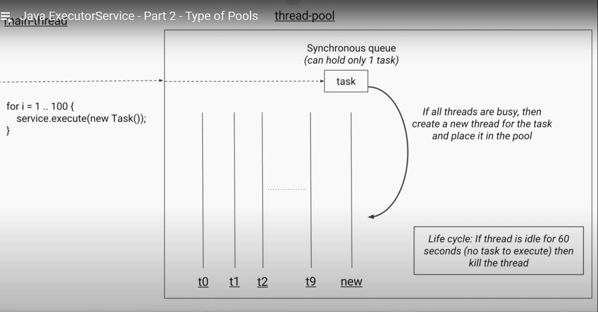

ExecutorService is a framework provided by the JDK which simplifies the execution of tasks in asynchronous mode. Generally speaking, ExecutorService automatically provides a pool of threads and API for assigning tasks to it.

